# ISS Deorbit: D Milestone

## What is the ISS? Give some historical context.

The ISS, or International Space Station, is a large, habitable spacecraft that orbits Earth. Its mission is to support scientific research in areas such as microgravity, Earth observation, and technology development, while also serving as a platform for international cooperation. The program brings together global expertise in engineering, communication systems, and space operations.

The ISS was designed between 1984 and 1993, with components constructed across the world, including in the United States, Canada, Japan, and Europe. Five space agencies were involved in its creation: NASA (United States), CSA (Canada), Roscosmos (Russia), JAXA (Japan), and ESA (Europe). Each agency was responsible for specific parts of the station’s construction, which were later launched and assembled in orbit.

The first module was launched in 1998, and the station has been continuously inhabited since 2000. It is the largest human-made object to orbit Earth, flying at an altitude of about 370–460 km (200–250 mi). The ISS has a mass of over 400,000 kg (900,000 lb) and measures roughly 109 m (358 ft) by 51 m (168 ft).

For more than 25 years, the International Space Station has circled our planet, hosting over 280 astronauts. It stands as one of humanity’s greatest achievements—pushing us to explore beyond Earth and expand our understanding of life in space. After three decades of service, the ISS is scheduled to deorbit in 2030, marking the end of this extraordinary chapter in human exploration.

## What are the considerations for its decommission?

### Background
- The path of deorbit must not go to/through a populated region
    - This is crucial and makes the mission a "must-work"
- ISS decommission is overseen by all ISS partners (NASA, CSA, ESA, JAXA, and Roscosmos)
- Communication will be done through Common Communications for Visiting Vehicles (C2V2)
- Multiple rendezvous attempts are possible if they are necessary for the De-Orbit vehicle to properly secure to the ISS
- This mission is planned for 2031, but the desire is to have it done as soon as possible in case of emergency

### Process
- A De-Orbit vehicle will be used to lower the altitude of the ISS during the final reentry burn
- The De-Orbit vehicle will attach to the ISS ~1 year before final reentry
- Once the altitude is lowered into a specified perigee, the De-Orbit vehicle will command a final burn to reenter the atmosphere
    - Perigee is the point in orbit when the ISS is closest to Earth

### Quantitative
- ISS mass is ~450,000 kg
- As the De-Orbit vehicle lowers the altitude, the goal is to move the ISS orbit into an ellipse of ~200x145 km
    - This equates to a rendezvous of 330-460 km
- Target is 41-47 m/s for delta-v and prop capability
    - Delta-v is change in velocity, or acceleration
    - Prop capability is the ability of the propulsion system, such as chemical or solar
- The final burn is targeting moving at 30 m/s to a perigee of 50 km
- Thrust of the De-Orbit vehicle must be at least 3236 N to hit the target delta-v and stay under 6178 N to maintain ISS structural integrity

## Describe the planned process broadly, defining *orbital decay*, *LEO*, *deorbit*, and *controlled re-entry*.

### Broad Overview of the Planned ISS Deorbit Process

In 2030, the ISS will undergo the *deorbit* process into an unpopulated region. First, its altitude will naturally decrease through *orbital decay* before final *deorbit* burns by the deorbit vehicle to achieve a *controlled re-entry*. 

This will be done by a carefully managed *deorbit* procedure, moving the ISS from its current position in *Low Earth Orbit (LEO)*, to an unpopulated *deorbit* target (e.g. the South Pacific Oceanic Uninhabited Area). Its altitude will gradually decrease over time due to the *orbital decay* caused by atmospheric drag. When the ISS is at a low enough altitude, a deorbit vehicle will perform final *deorbit* burns to lower its altitude further and place it on a trajectory for a *controlled re-entry*. This will ensure that the ISS will re-enter the Earth's atmosphere safely and predictably, with all debris landing a remote ocean area.

### Key Definitions

1. *Orbital decay*:
    The gradual decrease in the altitude of a satellite (e.g. the ISS) over time due to atmospheric drag and gravitational forces, which slowly lower its orbital energy.

2. *Low Earth Orbit (LEO)*:
    The region of space which is below 2,000km above the Earth's surface. It is where the ISS and most other satellites operate, as it is close enough to Earth for transport, communications, observation, and supply to be feasibly accomplished.

3. *Deorbit*:
    The deliberate process of reducing the altitude of a spacecraft in order to re-enter the Earth's atmosphere, typically through controlled engine burns or thruster firings.

4. *Controlled re-entry*: 
    The descent of a spacecraft into the Earth's atmosphere, which is designed to ensure that the debris lands in a predetermined, uninhabited area. Its main aim is to recapture the spacecraft, whilst minimizing risks to people and property.

## What are the factors that determine safety?

To safely deorbit and perform a re-entry of the ISS, maintaining control of the ISS through the final phases of the descent to make sure that debris falls in a remote area of the ocean without endangering life or property.

### Factors Determining Safety

**Controlling the re-entry location**
The trajectory must precisely target to South Pacific Ocean Uninhabited Area
Even minor errors in altitude, timing, or angle can shift the debris footprint by hundreds of kilometers

**Thrust Accuracy and Timing**
The deorbit burn applies a change in momentum to lower the perigee into the Earth’s atmosphere. 
Inaccurate thrust magnitude or direction can create an uncontrolled descent.

**Vehicle Structure and Breakup**
The ISS must break up in stages between 80-50 km altitude.
Simulations must predict how and when components fragment to minimize risk of large debris
Debris tracking after reentry should confirm the locations all fragments landed in uninhabited locations.

**Atmospheric and Environmental Conditions**
Variations in upper-atmosphere density due to solar heating or geomagnetic storms alter the forces acting on the ISS.
Environmental monitoring would ensure no hazardous materials stay in the splashdown zone.

**Command and Control**
Communication systems are required throughout the deorbit.
Backup automation must ensure the maneuver completes safely even if real-time commands fail.

## For each team member’s role, what physical laws apply, and what forces are important?

1. **Orbital decay**
2. **Final burn**
3. **Re-entry trajectory**
4. **Rocket trajectory**

Newton's second law (F=ma) is important in modeling the orbital decay section. However, as it requires mass to be constant, it does not apply to final burn, re-entry trajectory or rocket trajectory. It is:

Newton's law of universal gravitation dictates the force of gravity between two objects. It provides the centripetal force needed for the ISS to orbit, and also partially leads to its natural decay of orbit. It also applies to the final burn, re-entry trajectory, and rocket trajectory. It is:

This can be broken down into x and y components as such:

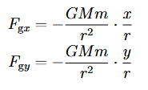

Drag reduces the speed of the ISS, which thereby lowers its orbital energy and decreases its altitude. It also applies for the final burn, re-entry trajectory, and rocket trajectory models. Drag through a fluid can be modeled as:

This can be broken down into x and y components as such:

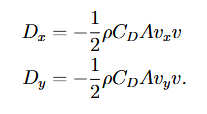

For the propulsion part, we deal with the thrust needed to drive the rocket forward by expelling propellant. This can be modeled with the conservation of momentum, which can be modified into the thrust equation using the impulse of the propellant. This affects the final burn, re-entry trajectory, and rocket trajectory. The thrust equation is:

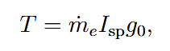

As previously mentioned, the rocket cannot be modeled as a particle as it does not have a constant mass (aside from during orbital decay). Therefore, we must use the conservation of momentum instead of Newton's second law. For a rocket, this acceleration can be expressed as:

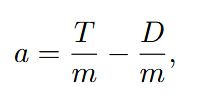

Again, as the mass of the rocket is not constant, this must be modeled through an equation:

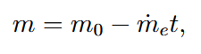

Additional considerations include stability and aerodynamics, which determine how smoothly the rocket flies through the air and how stable it remains during flight. This part of the analysis relies on the physics of torque, aerodynamic drag, and lift, all of which influence how the rocket moves and stays balanced. 

Finally, simulation helps us predict the rocket’s performance and trajectory before launch. For these simulations to be accurate, all of the above physical laws must be applied — including the Conservation of Energy, which explains how burning fuel converts chemical energy into kinetic and potential energy, and the principles of kinematics, which allow us to model and predict the rocket’s motion.

## Sketch a free-body diagram of each member’s physical model for this milestone.

1. 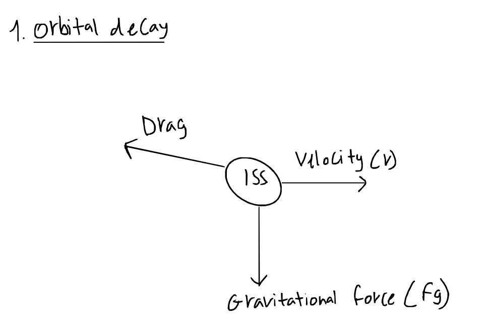

2. 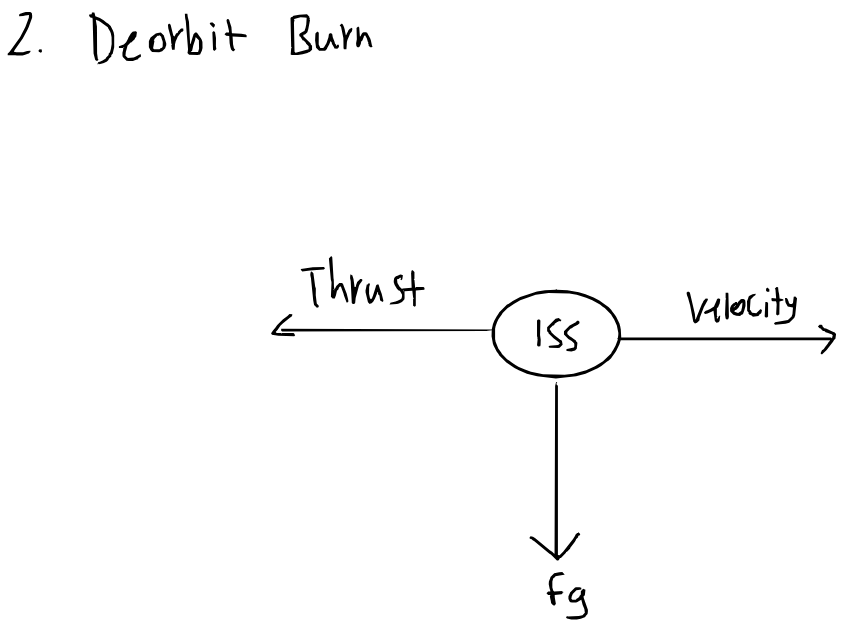

3. 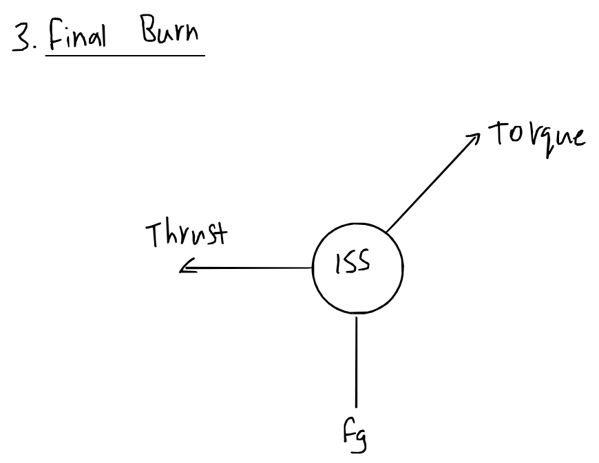

4. 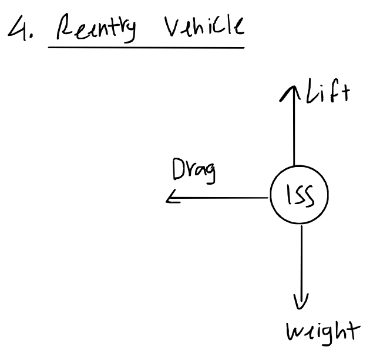

5. 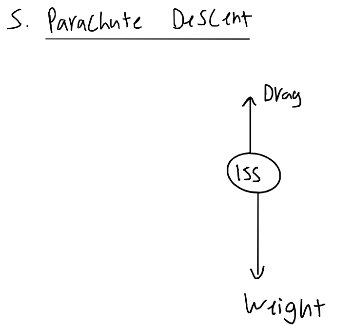

6. 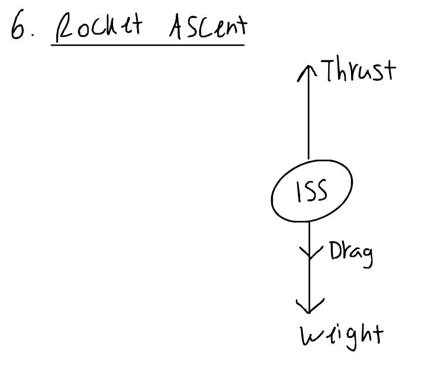

7. 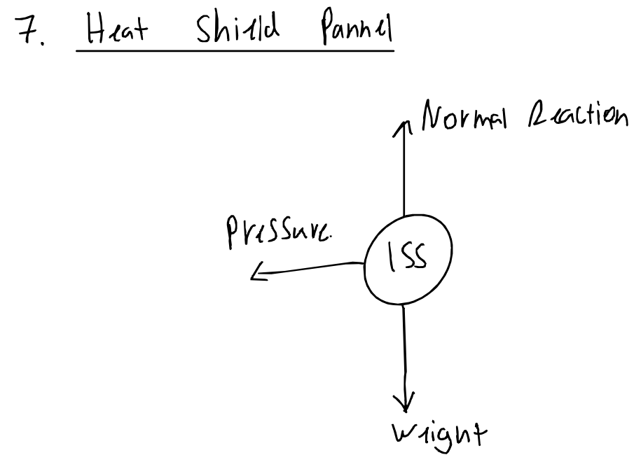

## Define *numerical simulation*, and describe the idea behind Euler's method, using a figure

- *numerical simulation* using Euler's method approximates a function using its starting point and derivative

**First Order Ordinary Differential Equations**
- Given that (t~0~0, y~0~0) is starting point
    - (t~n~0, y~n~0) is any point for n = 1, 2, 3, ...
    - t~n+1~0 = t~n~0 + Δt for n = 0, 1, 2, ...
        - OR t~n+1~0 = t~0 + (n+1)Δt for n = 0, 1, 2, ...

- y~1~0 = y~0~0 + Δy
- Δy = slope~0~0Δt
- y~1~0 = y~0~0 + (dy/dt)Δt

- This can be extrapolated to y~n+1~0 = y~n~0 + (dy/dt)Δt for n = 0, 1, 2, ...
- The simulation will accumulate error as t increases, so higher order methods are more exact
    - Second order ordinary differential equations are commonly used with motion because acceleration is the second derivative of position

## Resources:
<https://website-f-25-1cbe32.pages.oit.duke.edu/project/iss_deorbit/eulers_method.html>
<https://website-f-25-1cbe32.pages.oit.duke.edu/project/iss_deorbit/physics.pdf>
<https://website-f-25-1cbe32.pages.oit.duke.edu/project/iss_deorbit/ISS+Deorbit+USOS+Concept+of+Operations+Overview.pdf>
<https://www.nasa.gov/faqs-the-international-space-station-transition-plan/>
<https://www.nasa.gov/current-reports-and-transcripts/>
<https://www.nasa.gov/humans-in-space/leo-economy-frequently-asked-questions/>
<https://digitalcommons.usu.edu/smallsat/2018/all2018/364/>
<https://www.nasa.gov/wp-content/uploads/2024/06/iss-deorbit-analysis-summary.pdf>
<https://www1.grc.nasa.gov/beginners-guide-to-aeronautics/four-rocket-forces/#external-factors>
<https://www.nasa.gov/international-space-station/?utm>